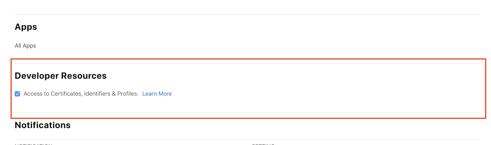

If you're a developer in an organization, just having the 'Developer' [role](https://developer.apple.com/support/roles/) doesn't let you run the app on devices. You must tick the box for access to Certificates, Identifiers & Profiles, found in 'Users and Access' in App Store Connect.

